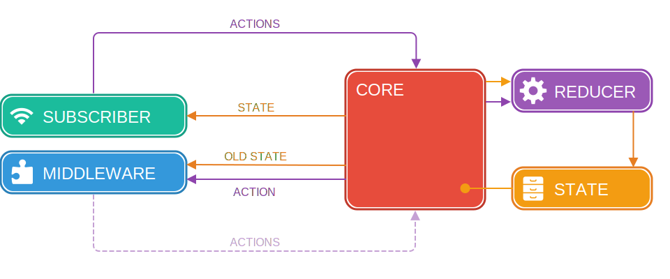

[](https://travis-ci.org/Unicore/Unicore)
[](https://cocoapods.org/pods/Unicore)
[](https://cocoapods.org/pods/Unicore)
[](https://cocoapods.org/pods/Unicore)

 The Unicore
======================================
The Unicore is a highly scalable application design approach which lets you increase the reliability of an application, increase testability, and give your team the flexibility by decoupling code of an application. It is a convenient combination of the data-driven and redux.js ideas. 

The framework itself provides you with a convenient way to apply this approach to your app.
- [Requirements](#requirements)
- [Design Approach](#design-approach)
  - [App State](#app-state)
  - [Core](#core)  
    - [State and Reducer](#state-and-reducer)  
  - [Actions](#actions)
  - [Reducer](#reducer)  
- [Installation](#installation)
- [Framework API](#api-and-usage)
  - [Create Core](#create-core)
  - [Dispatch](#dispatch)  
  - [Subsribe](#subscribe)  
  - [Register Middleware](#register-middleware)
  - [Dispose](#dispose)  
- [Examples](#examples)
  - [The Movie DB (tbd)](#the-movie-db)
  - [Counter (tbd)](#the-movie-db)
  - [ToDo list (tbd)](#the-movie-db)
- [Credits](#credits)
- [License](#license)


# Requirements

* iOS: 9.0 +
* macOS: 10.10 +
* watchOS 2.0 +
* tvOS: 9.0 +

# Design Approach

The idea behind the Unicore is to have one *single source of truth* (app state) and make changes in a *unidirectional* manner.



## App State

The app state would be that source it's a plain structure which conforms to `Codable` protocol. For example simple structure like this:

```swift
struct AppState: Codable {
    let counter: Int
    let step: Int
}
```
Let's imagine a simple app where we need to show the counter and increase/decrease buttons. And to add a bit of logic let's also have the control on a step.

So, in that case, the `AppState` would be our only source of the current app state, we look into the instance of the `AppState`  and we have the right values we need to display.
That's what is **single source of truth**.

But the problem here would be to give access to that state for each part of the app, screens, services, etc. and more importantly provide them with a way to mutate this state, so everybody knows that it was changed. The `Observer` pattern would solve these problems, but to make changes, we need some external ways not only internal as they usually are in the observer.

That's why we use the `Event Bus` pattern to solve this, and we dispatch actions to the [Core](#core) which would mutate the state.


## Core

`Core` is a dispatcher of the action, it uses the serial queue beneath so only one action gets handled at once that is why it is so important to not block a reducer function. `Core` is a generic type, so we can create it for any state we want, the only constraint is that it must conform `Codable`.

```swift
    let core = Core<AppState>( // #1
        state: AppState(counter: 0, step: 1), // #2
        reducer: reduce // #3
    )
```
1. Set the generic parameter to `AppState` to let `Core` knows that we need a reducer which deals with `AppState` as a state.
2. Providing `Core` with the initial state
3. Providing core with the reducer, the function we have written before.

When you dispatch an action to the core, it uses a [Reducer](#reducer) to create a new version of the app state and then lets every subscriber know that there is a new app state.


## Actions

Actions are also plain structures conforming to `Action` protocol (which conforms to `Codable`):

The name of the action describes what has happened, and fields of the action (payload) describe the details of the event. For example this action:
```swift
struct StepChangeRequested: Action {
    let step: Int
}
```      
means that step change was requested and the new step requested to be equal to field `step`.

Some actions might contain no fields and the only information they bring is the name of the action.
```swift
struct CounterIncreaseRequested: Action {}
struct CounterDecreaseRequested: Action {}

```      

These actions give us information that an increase or decrease of the counter was requested.

Having current state and action we can get the new state using `Reducer`.

## Reducer
A Reducer is a function which gets a state and action as a parameter and returns a new state, it's a pure function, and it must not block a current thread, that means every heavy calculation must be not in reducers.

And reducers are the only way to change the current state, for example, let's change the step if the action is `StepChangeRequested` then we update the step with the payload value:

```swift
func reduce(_ old: AppState, with action: Action) -> AppState {    
    switch action {
        
    case let payload as StepChangeRequested: // #1
        return AppState( // # 2
            counter: old.counter, // #3
            step: payload.step // #4
        )

    default:return old // #5
    } 
}
```
1. Unwrap `payload` if action is `StepChangeRequested` 
2. Return new instance of `AppState`
3. `counter` value stays the same
4. `step` updates with the new value from `payload` 
5. for all other actions returns the old state

Test of this reducer might be something like this:
```swift
func testReducer_StepChangeRequestedAction_stepMustBeUpdated() {
    let sut = AppState(counter: 0, step: 1)
    let action = StepChangeRequested(step: 7)
    let new = reduce(sut, with: action)
    XCTAssertEqual(new.step, 7)
}
```

Let's also add handlers for an increase and decrease actions:

```swift
func reduce(_ old: AppState, with action: Action) -> AppState {
    switch action {
        
    case let payload as StepChangeRequested:
        return AppState(
            counter: old.counter,
            step: payload.step
        )

    case _ as CounterIncreaseRequested: // #1
        return AppState(
            counter: old.counter + old.step, // #2
            step: old.step
        )

    case _ as CounterDecreaseRequested:
        return AppState(
            counter: old.counter - old.step,
            step: old.step
        )

    default:return old
    }
}
```

1. A wildcard used  because we don't need a payload
2. We calculate a new value for `counter`

And tests would look something like this:

```swift

func testReducer_CounterIncreaseRequested_counterMustBeIncreased() {
    let sut = AppState(counter: 0, step: 3)
    let action = CounterIncreaseRequested()
    let new = reduce(sut, with: action)
    XCTAssertEqual(new.counter, 3)
}

func testReducer_CounterDecreaseRequested_counterMustBeDecreased() {
    let sut = AppState(counter: 0, step: 3)
    let action = CounterDecreaseRequested()
    let new = reduce(sut, with: action)
    XCTAssertEqual(new.counter, -3)
}
```

Alright, we prepare everything we need for making the application working, the only thing needed is to create our `Core` instance:


# Installation

Unicore is available through [CocoaPods](https://cocoapods.org). To install
it, simply add the following line to your Podfile:

```ruby
pod 'Unicore', :git => 'git@github.com:Unicore/Unicore.git', :branch => 'release-1-0'
```
# API and Usage

## Create Core

To use Unicore you have to create a `Core` class instance. 

### State and Reducer
Since `Core` is a generic type, before that you have to define `State` class, it might be of any type you want. Let's say we have our state described as a structure:
```swift
struct AppState {
    let a: Int
    let b: String
    
    // Shortcut to create a default AppState.
    static let initial = AppState(a: 0, b: "")
}
```
then you need to describe how this state is going to react to actions:
```swift
func reducer(old: AppState, with action: Action) -> AppState {
    
    // handle CounterIncreaseRequested action
    if action is CounterIncreaseRequested {
        return AppState(
            a: old.a + 1,
            b: old.b
        )
    }

    return old
}
```
now you good to go and you can create an instance of the Core
```swift
let core = Core<AppState>(state: AppState.initial, reducer: reducer)
```

That's it we good to go, now we can dispatch an `Action` to modify our state or subscribe to state changes.


## Dispatch


## Subsribe

## Register Middleware

## Dispose

# Examples


# Credits

[Maxim Bazarov](https://github.com/MaximBazarov): A maintainer of the framework, and an evangelist of this approach.

[Alexey Demedetskiy](https://github.com/AlexeyDemedetskiy): An author of the original swift version and number of examples.

[Redux JS](https://redux.js.org/): The original idea.


# License

Unicore is available under the MIT license. See the LICENSE file for more info.
